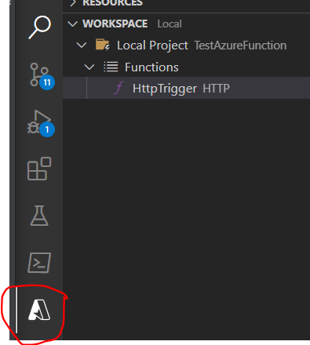
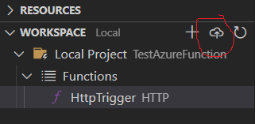

# Echo function

+ Open Visual Studio code
+ In the command palette (Ctrl+Shift+P) type Azure Function: Create new project
    + Select a folder
    + Select Python and Python interpreter
    + Select the Http trigger template
    + Use HttpTrigger as name for the Http trigger
    + Select Anonymous as Authorization level
    + Open in current window
+ Press F5 to test the echo function (it runs locally in a function emulation)
+ Test your endpoint by calling http://localhost:7071/api/HttpTrigger?name=test

# Create azure function
+ In the command palette (Ctrl+Shift+P) type Azure Function: Create function app in Azure
+ Select your subscription
+ Enter a name for your function app. The name needs to be globally unique.
+ Select Python 3.7 as runtime stack
+ Select West Europe (shouldn't be that important)
+ Wait until the function app is created

# Upload to azure function
+ Open the azure tab
+ 
+ Click the upload button
+ 
+ Select the subscription
+ Select your function app (if it is not visible in the resource field, restart VS Code and retry)
+ Click deploy
+ Wait until everything is deployed 
+ Test your endpoint by calling https://<name_of_your_function_app>.azurewebsites.net/api/httptrigger?name=test

+ Go to portal.azure.com -> Navigate to your function app and experiment a little bit what you can see there -> Monitoring, Executions, ...

