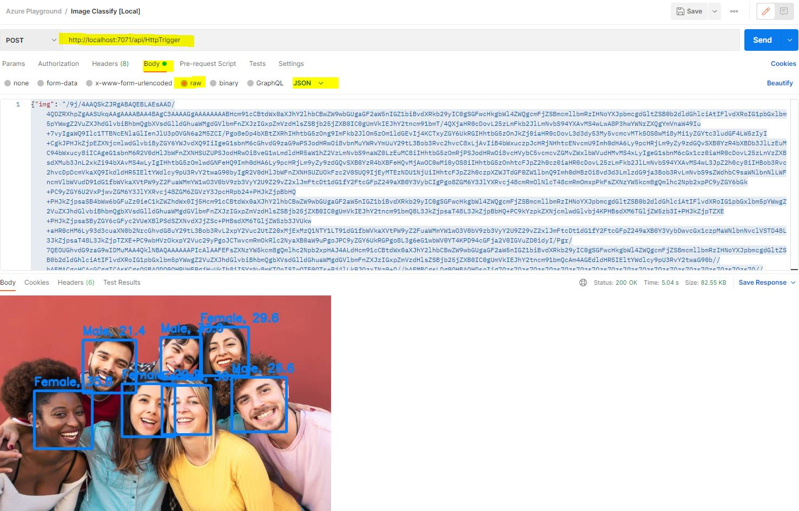

# Gender recognition

This section explains the steps to add (age and) gender recognition functionality to your function endpoint.

+ in requirements.txt add following dependencies:

  ```
  numpy
  onnxruntime 
  opencv-python==4.1.0.25
  ```

+ Copy `__init__.py` and `box_utils.py` from this folder to your HttpTrigger folder. Overwrite `__init__.py`
+ Create new subdirectory `models` under the `HttpTrigger` folder
+ Download following model files and put them into `models` folder:
  + https://github.com/onnx/models/raw/main/vision/body_analysis/emotion_ferplus/model/emotion-ferplus-8.onnx
  + https://github.com/onnx/models/raw/main/vision/body_analysis/ultraface/models/version-RFB-640.onnx
  + https://github.com/onnx/models/raw/main/vision/body_analysis/age_gender/models/vgg_ilsvrc_16_gender_imdb_wiki.onnx
+ Press `F5` to start the function app.
  + In case of phyton errors execute <code>python -m pip install --upgrade pip</code> in a VS Code terminal and retry    

+ Test the function app with postman.
  + Make a new request to http://localhost:7071/api/httptrigger
  + Create a body select and raw and JSON as format.
  + Use this json as template:
    + {"img": "<insert the base64 encoded image here>"}
  +   
  + Find an image from a face you want to know the age and gender and base64 encode the content.
    + You can use this for example: https://elmah.io/tools/base64-image-encoder/

+ Alternativly use the provided HTML template - upload.html - to test your function.
  + To get it working you need to consider CORS
  + For local development extend <code>local.settings.json</code>
    ```
    {
      "IsEncrypted": false,
      "Values": {
        "AzureWebJobsStorage": "",
        "FUNCTIONS_WORKER_RUNTIME": "python"
      },
      "Host": {
        "CORS": "*"
      }
    }
    ```
  
  + For deployed versions go to portal.azure.com
    + Navigate to functions app and enable CORS for the domain * (menu point on the left side at the bottom)
    + In production do not enable *, just for testing here. If you want to be precise just enter the domain your are executing the request from.
    +     
    
+ Upload the function as learned in step 1.
+ Try it again with the Azure function app.

### Pro Stage
+ If you want to play around with age classification take a look at this model https://github.com/onnx/models/blob/main/vision/body_analysis/age_gender/models/vgg_ilsvrc_16_age_imdb_wiki.onnx
+ Be aware that due to memory restrictions on functions (1.5Gb RAM) emotion and age classification will not work at the same time - Choose either or. ;)
